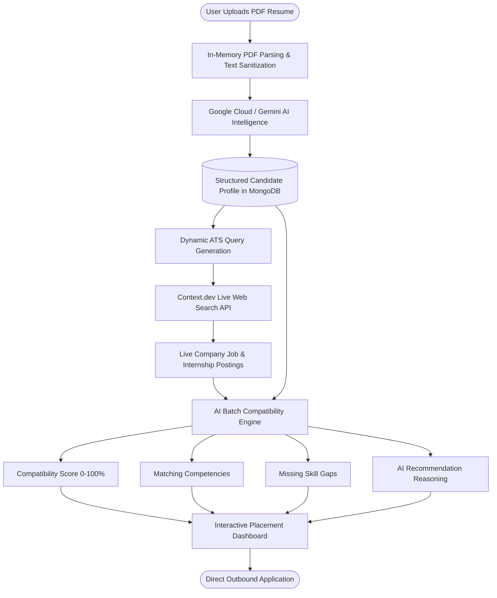

# CareerLens

> **Stop searching. Start matching.**

[](https://react.dev/)
[](https://nodejs.org/)
[](https://cloud.google.com/run)
[](https://cloud.google.com/vertex-ai)
[](https://www.mongodb.com/)
[](https://supabase.com/)
[](https://context.dev/)

---

CareerLens is an AI-powered student placement and internship discovery platform that transforms how university students and early-career engineers transition from a static resume to active, highly relevant career opportunities.

Rather than relying on manual keyword searches across disconnected job boards, CareerLens provides an intelligent, end-to-end workflow:

$$\text{Resume Understanding} \longrightarrow \text{Live Market Research} \longrightarrow \text{AI Compatibility Matching} \longrightarrow \text{Skill-Gap Identification} \longrightarrow \text{Informed Application}$$

By analyzing the candidate's actual projects, verified skills, and technical depth first, CareerLens actively explores live hiring boards and scores every opportunity with transparent match percentages, matching competencies, and concrete missing skill breakdowns.

---

## 🚨 The Problem

University students and early-career candidates face recurring friction during internship and campus placement preparation:

* **Scattered Opportunities**: Openings are dispersed across dozens of ATS portals (Greenhouse, Lever, Ashby, Workday) and company career pages with no unified discovery layer.
* **Information Overload & Search Fatigue**: Students spend hours manually searching, opening multiple tabs, and parsing long, repetitive job descriptions filled with generic boilerplate.
* **Generic Keyword Boards**: Traditional job boards match on superficial keyword strings without understanding the candidate's actual technical depth, project context, or coursework.
* **Qualification Uncertainty**: When a role lists 8–10 requirements and a student possesses 6, they often experience severe hesitation or abandon the application entirely because they cannot determine if missing 1 or 2 skills disqualifies them.
* **Invisible Skill Gaps**: Job boards show job listings, but never explain *why* a candidate fits or *what specific skills* they need to learn to bridge the gap.

---

## 💡 Our Solution

CareerLens is built as an **integrated candidate-first intelligence workflow** rather than a passive job aggregator.

Instead of scraping random listings and expecting the student to filter them manually, CareerLens starts with the candidate:

1. **Understands the Candidate First**: Ingests and parses the student's PDF resume to extract structured technical skills, frameworks, databases, tools, projects, and education.
2. **Researches Live Opportunities**: Dynamically formulates targeted ATS search queries and explores active company career sites via the Context.dev web search API.
3. **Performs Objective AI Matching**: Evaluates the candidate's verified profile against each opportunity using Gemini / Google Cloud Vertex AI, adhering to strict structured schemas.
4. **Delivers Transparent Insights**: Provides a 0–100% compatibility score, explicit highlights of matching skills, precise identification of missing skills, and clear AI recommendations with direct application links.

---


## 🔗 Live Link

* **Live Application**: [https://careerlens-511006.web.app](https://careerlens-511006.web.app)

---

## ✨ Key Features

* 🔐 **Secure Authentication**: JWT-based session security, password hashing via `bcryptjs`, and protected candidate profiles.
* 📄 **Encrypted Resume Management**: Validated PDF resume upload stored in user-isolated Supabase Storage buckets.
* 🧠 **AI Resume Intelligence**: Structured extraction of candidate summaries, programming languages, frameworks, developer tools, and academic backgrounds.
* 🌐 **Live Web Discovery**: Targeted ATS discovery (Greenhouse, Lever, Ashby, direct career portals) powered by Context.dev.
* 🎯 **AI Compatibility Matching**: Strict schema-grounded matching providing transparent 0–100 placement scoring (*Strong Match*, *Good Match*, *Possible Match*, *Low Match*).
* 🔍 **Skill-Gap Analysis**: Clear side-by-side view of competencies you possess versus missing skills required for the role.
* ⚡ **Interactive Filtering & Sorting**: Instant client-side filters for Job Type (Internship / Full-time), Work Mode (Remote, Hybrid, On-site), Match Score thresholds, and keyword search.
* 🔗 **Direct One-Click Apply**: Direct outbound links (`target="_blank"`) to verified employer application pages.

---

## 🔄 How CareerLens Works



---

## 🏗️ Architecture

```
React 18 + Vite (SPA Frontend)
        │
        ▼ HTTPS / REST (JWT Auth)
Google Cloud Run (Serverless Container)
        │
        ▼
Node.js + Express API Server
   ├── MongoDB Atlas          → Candidate profiles, credentials, preferences
   ├── Supabase Storage       → Encrypted, user-isolated PDF resume documents
   ├── Context.dev Web API    → Real-time hiring portal search & discovery
   └── Gemini / Vertex AI     → Structured resume intelligence & placement scoring
```

### Architectural Decisions:
* **React + Vite**: Delivers sub-second local updates, fast page transitions, and smooth client-side filtering without layout thrashing.
* **Node.js + Express**: Non-blocking asynchronous runtime handling file streams, multi-query web searches, and batch AI evaluations.
* **MongoDB Atlas**: Document-oriented persistence perfectly suited for evolving candidate profile schemas and flexible search preferences.
* **Supabase Storage**: S3-compatible managed object storage with strict MIME/size validation and isolated paths (`resumes/{userId}/resume.pdf`).
* **Context.dev**: Live search engine optimized for developer and job market research across enterprise ATS platforms.
* **Google Cloud Vertex AI / Gemini API**: Generative foundation models producing strict JSON outputs conforming to OpenAPI schemas.
* **Google Cloud Run**: Fully managed serverless container runtime with built-in HTTPS, custom domains, and automatic scaling.

---

## 🧠 AI & Intelligence

CareerLens utilizes Google's Gemini models (via Google Cloud Vertex AI & Google Gen AI SDK) across three distinct stages:

1. **Resume Parser**: Transforms unstructured resume text into a normalized JSON candidate profile:
   ```json
   {
     "summary": "Full Stack Developer with experience in React and Node.js microservices",
     "skills": ["JavaScript", "Python", "React", "Node.js", "MongoDB", "Docker"],
     "experienceLevel": "Student",
     "preferredRoles": ["Software Engineer Intern", "Frontend Developer"]
   }
   ```
2. **Search Query Synthesizer**: Formulates focused search queries targeting direct hiring boards rather than generic aggregators (e.g. `site:boards.greenhouse.io "Software Engineer Intern" "2026"`).
3. **Structured Compatibility Matcher**: Executes schema-constrained batch evaluations comparing candidate facts against job requirements to produce deterministic match metrics:
   ```json
   {
     "matchScore": 88,
     "recommendation": "Strong Match",
     "matchingSkills": ["React", "JavaScript", "REST APIs"],
     "missingSkills": ["GraphQL", "AWS"],
     "reason": "Strong alignment with core frontend stack. Missing cloud infrastructure experience can be quickly bridged."
   }
   ```

---

## 🎯 Why CareerLens?

| Existing Approach | Limitation | CareerLens Advantage |
| :--- | :--- | :--- |
| **Generic Job Boards** (LinkedIn, Indeed) | Keyword-based, cluttered, and impersonal; ignores candidate resume depth. | Discovers active opportunities targeted to candidate profile facts and preferred work modes. |
| **Resume Scanners / ATS Checkers** | Static keyword score without finding actual opportunities to apply for. | Connects parsed resume competencies directly to live market job discovery. |
| **Manual Platform Searching** | Fragmented, repetitive, and high context-switching friction. | Automated research across live career sites with deduplicated results. |
| **Generic AI Chatbots** | Requires manual prompt pasting, lacks persistent storage, and produces hallucinations. | Grounded structured schema analysis that strictly checks overlap without hallucinating requirements. |

---

## 👤 Who It's For

* **University Students**: Preparing for campus placement seasons and summer internships.
* **Early-Career Developers**: Transitioning into software engineering roles and seeking objective skill-gap feedback.
* **Self-Taught & Bootcamp Graduates**: Identifying which additional industry technologies to learn based on real-time market demand.

---

## 🛠️ Tech Stack

* **Frontend**: React 18, Vite, React Router 6, Tailwind CSS, Lucide Icons, Axios
* **Backend**: Node.js, Express, Mongoose (MongoDB ODM), Multer, `pdf-parse`, `bcryptjs`, `jsonwebtoken`
* **AI & Language Models**: Google Cloud Vertex AI / Gemini (`@google-cloud/vertexai`, `@google/genai`)
* **Live Web Research**: Context.dev Search API (`/v1/web/search`)
* **Database & Storage**: MongoDB Atlas, Supabase Storage
* **Cloud & Hosting**: Google Cloud Run (Backend), Firebase Hosting (Frontend)

---

## 📁 Project Structure

```
CareerLens/
├── client/                     # React + Vite Frontend
│   ├── public/                 # Static assets & SPA redirects
│   ├── src/
│   │   ├── components/         # Reusable UI (Navbar, Skeletons, Alerts, SearchBar)
│   │   ├── context/            # AuthContext state management
│   │   ├── pages/              # Landing, Login, Register, Dashboard, Opportunities
│   │   └── services/           # Centralized API clients (api.js, opportunityService.js)
│   └── package.json
├── server/                     # Express Backend
│   ├── config/                 # DB, Supabase, Google Cloud, Env Validators
│   ├── controllers/            # Auth, Profile, Resume, Opportunity controllers
│   ├── middleware/             # Auth (JWT), Upload (Multer), Error Handlers
│   ├── models/                 # Mongoose User & CandidateProfile models
│   ├── routes/                 # Express API route declarations
│   ├── services/               # Vertex AI, Context.dev, PDF Parser, Opportunity Matcher
│   ├── Dockerfile              # Production Node container image
│   ├── testAuth.js             # Automated 78-assertion test suite runner
│   └── package.json
├── evidence/                   # User research & survey data
│   ├── README.md               # Survey analysis & student insights
│   └── Survey Responses.xlsx   # Survey dataset
├── DEPLOYMENT.md               # Production deployment runbook
├── .env.example                # Sample environment configuration template
└── README.md                   # Project documentation
```

---

## 🚀 Getting Started

### 1. Prerequisites
* **Node.js** (v18.0.0 or higher)
* **npm** (v9.0.0 or higher)
* **MongoDB Atlas** database URI
* **Supabase** project URL & Service Role Key
* **Context.dev** API Key
* **Google Gemini API Key** or **Google Cloud Vertex AI** credentials

### 2. Clone Repository & Install Dependencies
```bash
git clone https://github.com/Prash-code9428/CareerLens.git
cd CareerLens

# Install root, backend, and frontend dependencies
npm run install:all
```

### 3. Configure Environment Variables
```bash
cp .env.example .env
```
Fill in the required keys in `.env` (see [Environment Variables](#-environment-variables)).

### 4. Start Development Servers
```bash
# Run backend server (Port 5000 / 8080)
npm run server

# In a separate terminal, run frontend client (Port 5173)
npm run client
```

* Frontend: `http://localhost:5173`
* Backend API: `http://localhost:5000` (or `http://localhost:8080`)
* Health Check: `http://localhost:5000/api/health`

### 5. Run Automated Tests
```bash
cd server
npm test
```

---

## 🔐 Environment Variables

| Variable | Description | Required For |
| :--- | :--- | :--- |
| `PORT` | Backend server port (Default: `5000` or `8080`) | Server |
| `NODE_ENV` | Runtime environment (`development` or `production`) | Server |
| `MONGODB_URI` | MongoDB connection string | Database |
| `JWT_SECRET` | Secret key for signing JSON Web Tokens | Authentication |
| `CLIENT_URL` | Allowed CORS origins (comma-separated for multiple) | Security |
| `SUPABASE_URL` | Supabase project instance URL | Resume Storage |
| `SUPABASE_SERVICE_ROLE_KEY` | Supabase service role secret key | Resume Storage |
| `SUPABASE_BUCKET` | Supabase storage bucket name (Default: `resumes`) | Resume Storage |
| `CONTEXT_API_KEY` | Context.dev web search API key | Live Job Search |
| `GEMINI_API_KEY` | Google AI Studio Gemini API Key | AI Intelligence |
| `GOOGLE_CLOUD_PROJECT_ID` | Google Cloud Project ID (Optional if using Gemini Key) | Vertex AI |
| `VERTEX_AI_LOCATION` | Vertex AI regional endpoint (Default: `us-central1`) | Vertex AI |
| `VERTEX_AI_MODEL` | Gemini model name (e.g. `gemini-3.8-flash` / `gemini-1.5-flash`) | AI Intelligence |
| `VITE_API_BASE_URL` | Base backend API URL consumed by the frontend | Frontend |

---

## ☁️ Deployment

* **Backend**: Containerized via Docker and deployed to **Google Cloud Run** with managed HTTPS and auto-scaling.
* **Frontend**: Built via Vite and hosted globally on **Firebase Hosting**.
* **Storage & Database**: Hosted on managed **MongoDB Atlas** and **Supabase Storage**.

For detailed deployment instructions, refer to [`DEPLOYMENT.md`](DEPLOYMENT.md).

---

## 📊 Evidence of Student Need

Findings from primary student survey research stored in [`evidence/README.md`](evidence/README.md) ($N = 16$ tech students and early-career candidates) highlight the core problems CareerLens solves:

* **Application Fatigue**: **43.8%** spend 15–30+ minutes manually tailoring resumes per application; **25.0%** have refrained from applying because the manual tailoring process takes too much time.
* **Hesitation & Uncertainty**: When missing 1 or 2 listed skills, **37.5%** frequently hesitate to apply and **62.5%** sometimes hesitate (**0%** apply without hesitation).
* **Lack of Alignment Visibility**: **56.3%** guess and hope for the best regarding how their qualifications align with job descriptions.
* **Student Testimonial**:
  > *"Job descriptions are often long, repetitive, and filled with 'nice-to-have' skills, making it hard to tell what I truly need to qualify for the role. The most valuable feature would be personalized skill-gap analysis showing exactly what skills I'm missing for the jobs I want."*

---

## 📌 Project Status

### ✅ Completed
- [x] JWT authentication and secure session management
- [x] Candidate profile configuration (education, target roles, location, work mode)
- [x] Secure PDF resume upload to Supabase Storage with size and MIME validation
- [x] Text parsing and Gemini / Vertex AI structured candidate competency extraction
- [x] Context.dev live web opportunity discovery with concurrency management
- [x] Batch AI opportunity compatibility matching, score calculation, and skill-gap breakdown
- [x] Multi-criteria client-side filtering (Job Type, Work Mode, Match Score, Keyword search)
- [x] Direct outbound application links to verified hiring portals
- [x] Cloud Run containerized backend and Firebase Hosting frontend deployment
- [x] 78/78 automated test suite covering Auth, Storage, Parsing, Search, and AI Matching

### 📋 Future Roadmap
- [ ] Automated skill-gap learning pathways (curated documentation and tutorial links).
- [ ] Application status tracker (Applied, Interviewing, Offered).
- [ ] Multi-resume versioning tailored per target domain (e.g., Frontend vs. Machine Learning).

---

